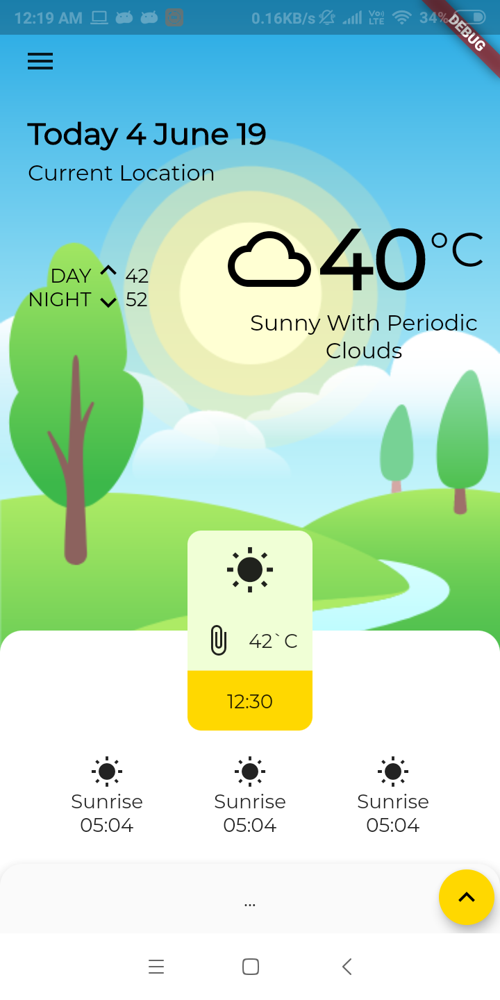
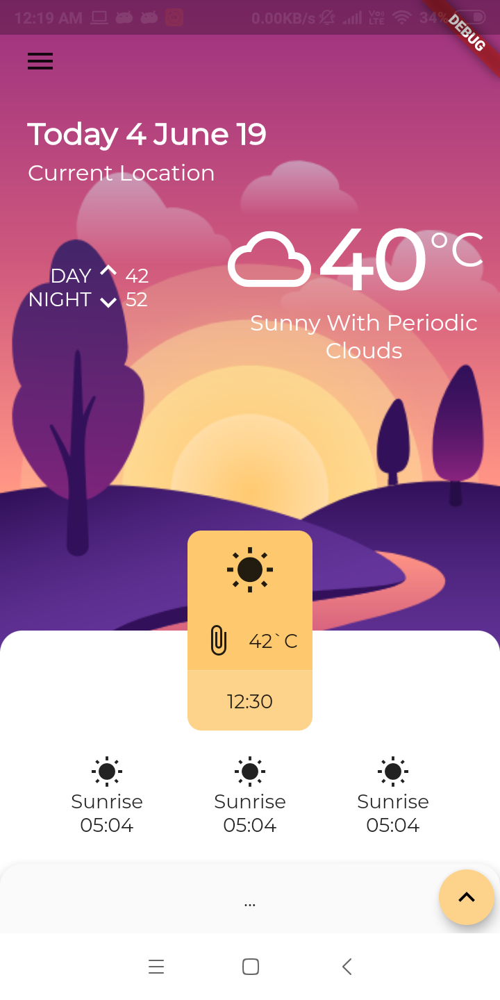
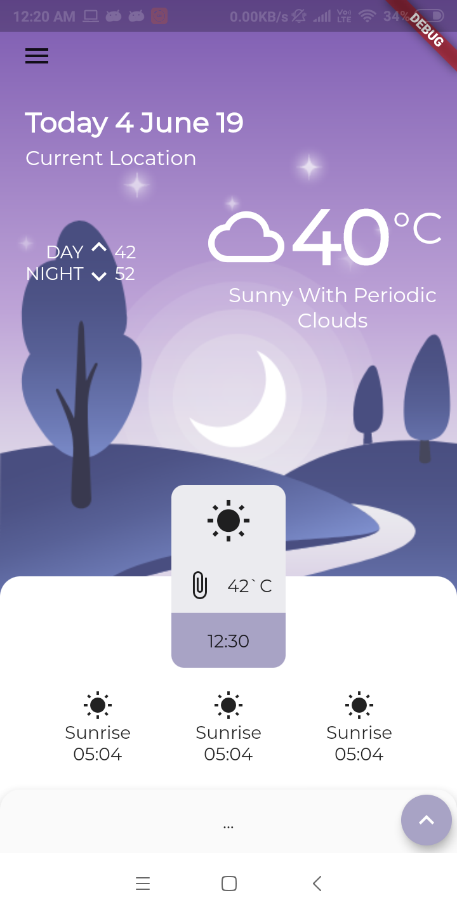
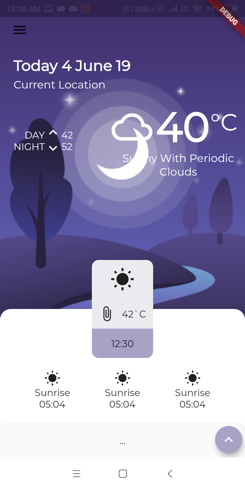
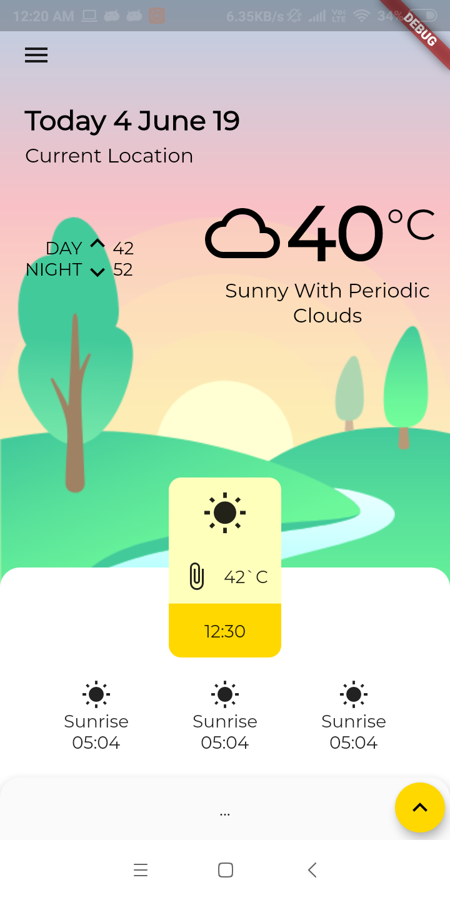
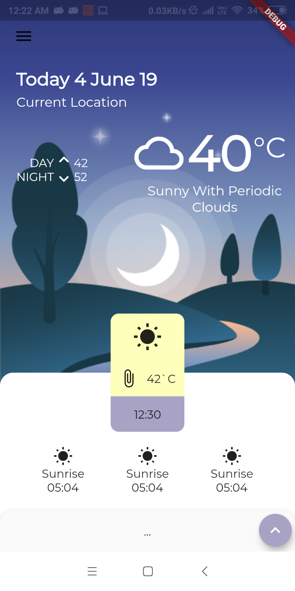

# Weather_app
Mobile Application built in Flutter

>Inspired By ***Moataz Mustapha*** https://www.uplabs.com/posts/weather-a29b437d-6f2d-46cb-8b4c-09f798627d73

## Steps to reproduce

**Step 1:** Install Flutter using latest official guide https://flutter.dev/docs/get-started/install

**Step 2:** Run application using `flutter run`